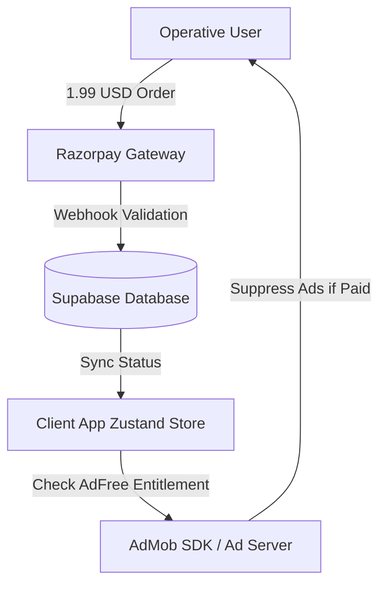
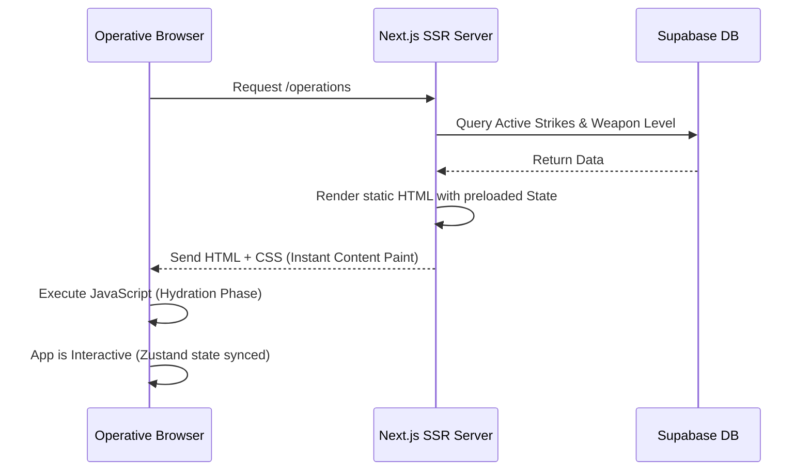

# ⚔️ Warscythe Future Expansion Strategy & Technical Roadmap

This roadmap details the architectural design, business benefit analysis, and step-by-step implementation strategy for the upcoming expansion of **Warscythe** across monetization systems, performance scaling, and database optimizations.

---

## 1. Monetization Architecture

To maximize revenue while maintaining the high-fantasy aesthetic, we propose a multi-tiered monetization system integrating **Razorpay** for payment processing, **AdMob** for ad inventory, and a secure entitlement system for user unlocks.



### A. Razorpay Integration
* **Benefit**: Low transaction fees, seamless integration in India (primary card/UPI hub), and international support via multi-currency routing (conversion of local currency to USD equivalent for the $1.99 tier).
* **Implementation**:
  1. **Order Creation**: Secure server-side endpoint (Supabase Edge Function or Node server) creates a Razorpay Order ID using the `razorpay` Node SDK:
     ```javascript
     const order = await razorpay.orders.create({
       amount: 199, // In cents or INR equivalent
       currency: "USD",
       receipt: `receipt_${userId}`
     });
     ```
  2. **Client Checkout**: Use Razorpay's Checkout SDK in the React/Capacitor frontend, passing the `order_id` and capturing the payment signature.
  3. **Verification**: A webhook listener captures the `payment.captured` event from Razorpay, decodes the signature, and updates the user's status in Supabase.

### B. Ad-Free Tier ($1.99 USD) & Virtual Assets (Paid Scythes/Themes)
* **Benefit**: Predictable subscription/one-time unlock revenue. Low friction entry point ($1.99).
* **Implementation Schema (`supabase/schema.sql`)**:
  ```sql
  -- Track user purchases and unlocks
  CREATE TABLE user_entitlements (
    user_id UUID REFERENCES auth.users(id) ON DELETE CASCADE,
    is_ad_free BOOLEAN DEFAULT FALSE,
    unlocked_scythes TEXT[] DEFAULT ARRAY['DORMANT'],
    unlocked_themes TEXT[] DEFAULT ARRAY['STANDARD'],
    updated_at TIMESTAMP WITH TIME ZONE DEFAULT NOW(),
    PRIMARY KEY (user_id)
  );
  ```
* **Store Integration (Zustand)**:
  - Add `isAdFree`, `unlockedScythes`, and `activeTheme` to `useWarscytheStore.js`.
  - Fetch entitlements on app load and conditionally render advertisements or apply custom Tailwind theme variables (e.g., `.theme-crimson-descent`, `.theme-cosmic-void`).

---

## 2. Aggressive Ad Strategy (AdMob)

To optimize CPM (Cost Per Mille) under an aggressive setup, ads must be integrated at natural "friction points" (transition states) where the cognitive workload changes.

### A. Placement Triggers & Transition Steps
1. **The Recalculate Protocol Interstitial**: When a user clicks "Recalculate Protocol," trigger an AdMob Interstitial Ad. While the loader animates "Recalculating...", the ad plays.
2. **Operation Completion Reward**: Upon completing a major operation (changing state from active to complete), serve an interstitial or rewarded video ad.
3. **Tab Switch Transitions**: When swiping between sub-tabs (`STRIKES` ⇄ `FORGE` ⇄ `COMMAND`) on mobile, trigger an ad every $N$ switches.

### B. Mobile vs. Web Integration
* **Mobile (Capacitor/Cordova)**: Use the `@capacitor-community/admob` plugin to load native Banner and Interstitial overlays.
* **Web (warscythe.xyz)**: Use Google AdSense or Ad Manager tags. Render programmatic banner ads inside the grid layout (e.g., replacing the bottom-most sidebar block or a container card).

### C. Revenue vs. User Experience (UX) Guardrails
* **Impression Frequency Capping**: Limit interstitial ads to once every 3 minutes per user to prevent app store rejection for "spammy behaviors."
* **Pre-fetching**: Load ads in the background (`admob.prepareInterstitial()`) during inactive states so they play instantly at transition steps.

---

## 3. Server-Side Rendering (SSR) & Hydration

Currently, the Vite project is Client-Side Rendered (CSR). Transitioning to a Server-Side Rendering (SSR) framework (like Next.js or Remix) will dramatically improve initial load speeds and SEO.



### A. The Hydration Process for High-Fantasy UI
* **How it works**:
  1. The server compiles the initial page state into raw HTML.
  2. The browser renders the visual elements instantly (fast First Contentful Paint).
  3. The browser downloads the client-side bundle and "hydrates" the static HTML, linking React events and Zustand state systems to the DOM elements.
* **Hydration Pitfalls in Interactive UI**:
  - Elements like the floating animations (`float-scythe`) and canvas background effects must only start *after* hydration. Use `useEffect` checks to ensure code only runs on the client:
    ```javascript
    const [isMounted, setIsMounted] = useState(false);
    useEffect(() => setIsMounted(true), []);
    if (!isMounted) return <ScytheFallback />;
    ```

---

## 4. Load Management & Database Scaling

As the user base grows, high concurrency during "completion spikes" (e.g., end of work days) will saturate the database connection pool and increase query latency.

### A. Redis Cache Layer
* **Benefit**: Reduces read load on Supabase by up to 90% by serving static configurations, lore, and user profile data from RAM.
* **Implementation Plan**:
  - **Session Cache**: Cache the user's active operations and profile levels. Set a TTL (Time-To-Live) of 10 minutes.
  - **Write-Through Caching**: When a user completes a task:
    1. Write update to Supabase database.
    2. Invalidate/write update to the Redis Cache.
    3. Return response to user.

```
[Client App] ──> [API Server] ──> [Redis Cache (Check Cache)] ──(Hit)──> [Return Data]
                       │
                    (Miss)
                       ▼
               [PostgreSQL DB] ──> [Write to Redis Cache] ──> [Return Data]
```

### B. PgBouncer Connection Pooling
* **Benefit**: PostgreSQL creates a new process for every client connection, which consumes substantial memory (~10MB per connection). Under load, this leads to connection exhaustion errors. **PgBouncer** sits between the app server and PostgreSQL, keeping a pool of active database connections open and recycling them.
* **Configuration**:
  - Since Supabase has built-in PgBouncer support, we switch our database connection strings from the direct port (`5432`) to the PgBouncer port (`6543`).
  - **Pooling Mode**: Set to **Transaction Mode** (ideal for serverless apps/Edge functions). This allows multiple fast, short transactions to reuse the same database connection sequentially.

---

## 5. Implementation Roadmap (Phased Rollout)

To minimize downtime and avoid breaking the existing build, execution should follow a 3-stage plan:

| Phase | Focus Area | Technical Deliverables | Impact |
|---|---|---|---|
| **Phase 1** | **Database & Connection Scaling** | Switch to Supabase PgBouncer (Port 6543); set up Redis for caching static lore and session data. | Zero connection dropouts, 10x faster lore read speeds. |
| **Phase 2** | **Monetization & AdMob** | Integrate Razorpay checkout; add Ad-Free check inside Zustand; set up AdMob interstitial hooks. | Start generating active ad revenue and capturing upgrades. |
| **Phase 3** | **Next.js SSR Migration** | Migrate from Vite React to Next.js (App Router); set up hybrid pages (Static / Server-rendered). | Perfect SEO metrics, sub-second load times on mobile browsers. |
